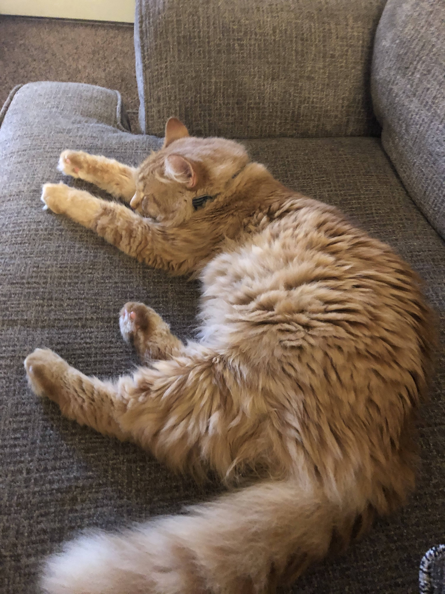

```{r echo = F}
colorize <- function(x, color) {
  if (knitr::is_latex_output()) {
    sprintf("\\textcolor{%s}{%s}", color, x)
  } else if (knitr::is_html_output()) {
    sprintf("<span style='color: %s;'>%s</span>", color, 
      x)
  } else x
}
```

# Welcome to Stat 101

Information about your instructor:

* Name: Charlotte Roiger
* Email: croiger@iastate.edu
* Office: Snedecor 2418


For sending emails: please put the phrase "STAT 101" and your lab section at the start of every email subject line and include a brief statement of your question or concern. Then please provide more detail in the body of the email. I will try to get back to you shortly. 


You can call me Charlotte, I'm a second year graduate student in Statistics! I have a degree in Mathematics from St. Olaf College in Minnesota. This is my first time teaching STAT 101 so this will be a learning process for both of us.

---

# I have a cat, his name is Angus

```{r, out.width="50%", fig.keep="hold", fig.align='center',echo=FALSE}

```

---

# What about you?

Turn to the person next to you and introduce yourselves! 

Share:

* Your major (if known)
* Your year
* One (1) fun fact about yourself


Statistics is by nature a collaborative discipline! I hope that you can work together in class and outside of class. Homework needs to be turned in individually but working in groups is allowed! Exams ofcrouse are individual. 
---

# Why I love statistics

* It's fun being able to draw meaningful conclusions from data!
* The mathematics of statistics is challenging but gratifying
* On a philsophical level, statistics has the power to discern truth and enhance human knowledge


