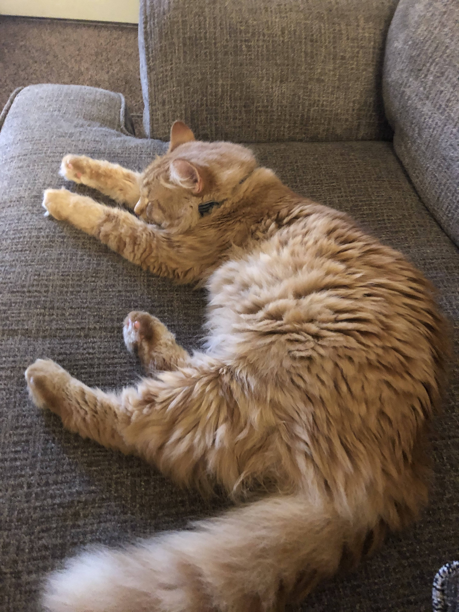

# Welcome to Stat 101

Information about your instructor:

* Name: Charlotte Roiger
* Email: croiger@iastate.edu
* Office: Snedecor 2418

When sending emails about this course please include "STAT 101" in the email subject line then provide a succinct statement of your questions or concerns in the body of the email. I will try to get back to you as soon as possible. 

---

.center[

]

---
